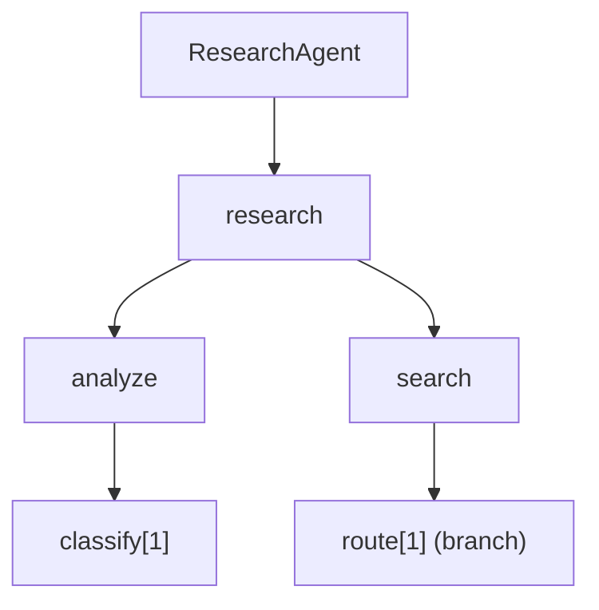

<p align="center">
  <h1 align="center">FlowForge</h1>
  <p align="center"><strong>Build AI Agents with Python Decorators, Not Boilerplate</strong></p>
</p>

<p align="center">
  <a href="#installation">Install</a> &bull;
  <a href="#quick-start">Quick Start</a> &bull;
  <a href="#features">Features</a> &bull;
  <a href="#how-it-works">How It Works</a> &bull;
  <a href="#documentation">Docs</a>
</p>

---

FlowForge is a Python framework that lets you define complex AI agent pipelines using **decorators alone**. No graph construction code, no YAML configs, no LangChain ceremony — just annotate your classes and functions, and FlowForge compiles them into an executable DAG.

```python
from flowforge import global_config, flow, task, step, FlowForge

@global_config(prompt="You are a helpful research assistant.")
class MyAgent:

    @flow(name="research", prompt="Analyze query and find answers")
    class ResearchFlow:

        @task(name="search", prompt="Search for relevant information")
        class SearchTask:

            @step(order=1, prompt="Expand and optimize the query")
            async def expand_query(ctx):
                return {"query": ctx.input["query"], "expanded": True}

            @step(order=2, prompt="Fetch results from sources")
            async def fetch_results(ctx):
                return {"results": ["..."], "source": "web"}

engine = FlowForge.compile(MyAgent)
result = await engine.run({"query": "AI agent frameworks in 2026"})
```

## Installation

```bash
pip install git+https://github.com/JY-1019/FlowForge.git
```

With optional extras:

```bash
pip install "flowforge[all] @ git+https://github.com/JY-1019/FlowForge.git"
pip install "flowforge[viz] @ git+https://github.com/JY-1019/FlowForge.git"
pip install "flowforge[mcp] @ git+https://github.com/JY-1019/FlowForge.git"
```

> Requires Python 3.11+

## Quick Start

### 1. Define your agent structure

```python
from flowforge import global_config, flow, task, step, FlowForge
from flowforge import LLMConfig, BranchCondition

@global_config(
    prompt="Multi-language research assistant",
    llm_config=LLMConfig(model="claude-sonnet-4-6", temperature=0.3),
)
class ResearchAgent:

    @flow(name="research", prompt="Analyze → Search → Answer")
    class ResearchFlow:

        @task(name="analyze", prompt="Classify user intent")
        class AnalyzeTask:
            @step(order=1, prompt="Extract intent and keywords")
            async def classify(ctx):
                return {"intent": "search", "keywords": ["AI"], "source": "web"}

        @task(name="search", prompt="Execute search based on analysis")
        class SearchTask:
            @step(
                order=1,
                prompt="Route to the best source",
                condition=BranchCondition(field="source", enum=["web", "db"]),
                branches={"web": web_handler, "db": db_handler},
                fallback=web_handler,
            )
            async def route(ctx): ...
```

### 2. Compile and run

```python
engine = FlowForge.compile(ResearchAgent)
result = await engine.run({"query": "latest AI trends"})
```

### 3. Visualize the DAG

```python
print(engine.mermaid())
```



## Features

### Annotation-First Design

Everything is a decorator. No manual graph wiring.

| Decorator | Purpose |
|-----------|---------|
| `@global_config` | Agent-level settings, LLM config, global tools |
| `@flow` | Top-level execution unit (nestable) |
| `@task` | Work unit within a flow (nestable) |
| `@step` | Atomic action within a task (ordered) |

### Recursive Nesting

Flows contain flows. Tasks contain tasks. Build any depth of hierarchy.

```python
@flow(name="pipeline", prompt="Main pipeline")
class Pipeline:
    @flow(name="ingestion", prompt="Data ingestion sub-flow")
    class Ingestion:
        @task(name="fetch", prompt="Fetch data")
        class Fetch: ...

    @task(name="transform", prompt="Final transformation")
    class Transform: ...
```

### Branch Dispatching (No Separate Decorator Needed)

Conditional routing is built into `@step`, `@task`, and `@flow`:

```python
@step(
    order=2,
    prompt="Route by document format",
    condition=BranchCondition(field="format", enum=["pdf", "csv", "json"]),
    branches={"pdf": pdf_handler, "csv": csv_handler, "json": json_handler},
    fallback=pdf_handler,
)
async def route_format(ctx): ...
```

### Route Execution

Run only specific parts of your agent:

```python
# Run a single flow
result = await engine.run(data, route="search")

# Run a specific task within a flow
result = await engine.run(data, route="research.analyze")

# Run multiple routes
result = await engine.run(data, route=["analysis", "report"])
```

### Task Loop (Retry with Condition)

Re-run a task until a quality threshold is met:

```python
@task(
    name="quality_check",
    prompt="Keep refining until quality is high",
    max_loops=5,
    loop_condition=lambda out: out.get("score", 0) >= 0.8,
)
class QualityCheck: ...
```

### Hierarchical Tools & LLM Calling

Tools cascade through the hierarchy. Call the LLM from any step:

```python
@global_config(prompt="...", tools=[MCPServer("https://api.example.com/mcp")])
class Agent:
    @flow(name="f", prompt="...", tools=[ToolConfig(name="calculator")])
    class F:
        @task(name="t", prompt="...", tools=[ToolConfig(name="formatter")])
        class T:
            @step(order=1, prompt="Use {query} to find answers <calculator>")
            async def solve(ctx):
                result = await ctx.call_llm("Solve: {query}")
                return result
```

### Parallel Execution

Nodes with the same `order` value run in parallel:

```python
@task(name="t", prompt="...")
class T:
    @step(order=1, prompt="Step A")  # runs in parallel with Step B
    async def a(ctx): ...

    @step(order=1, prompt="Step B")  # same order = parallel
    async def b(ctx): ...

    @step(order=2, prompt="Step C")  # runs after A and B complete
    async def c(ctx): ...
```

### Compile-Time Validation

Catch errors before runtime:

- Order uniqueness within tasks
- I/O schema compatibility between steps
- Branch handler output type consistency
- DAG cycle detection

### CLI

```bash
flowforge validate ./agent.py     # Check for compile errors
flowforge viz ./agent.py --mermaid  # Print Mermaid diagram
flowforge run ./agent.py --query "test"  # Execute the agent
flowforge doc-generate ./agent.py  # Auto-generate node docs via LLM
```

## How It Works

```
@step → @task → @flow → @global_config → FlowForge.compile()
  │        │       │          │                    │
  │        │       │          │                    ▼
  │        │       │          │              Build DAG (networkx)
  │        │       │          │              Topological sort
  │        │       │          ▼              Cycle detection
  │        │       │    Scan for flows       Validate I/O chains
  │        │       ▼                               │
  │        │   Scan for tasks/flows                │
  │        ▼                                       ▼
  │   Scan for steps/child tasks            ExecutionEngine
  ▼                                         (async runner)
Attach metadata to function
```

1. **Decorate** — Each decorator attaches metadata to the class/function
2. **Compile** — `FlowForge.compile()` reads the metadata tree and builds a DAG
3. **Validate** — Schema compatibility, order conflicts, and cycles are checked
4. **Execute** — The async engine traverses the DAG, passing data between nodes

## Project Structure

```
flowforge/
├── annotations/    # Decorators, metadata, validators
├── schema/         # DAG compiler, registry, resolver
├── execution/      # Async runners, context, LLM integration
├── tools/          # MCP, HTTP, function tool adapters
├── planner/        # AI-driven path selection
├── viz/            # Mermaid & Graphviz rendering
└── cli/            # Typer-based CLI
```

## Documentation

Full documentation is available via [MkDocs Material](https://squidfunk.github.io/mkdocs-material/).
After installing with the `[docs]` extra, a single command spins up the local docs server
and opens it in your browser — no repo clone required:

```bash
pip install "flowforge[docs] @ git+https://github.com/JY-1019/FlowForge.git"
flowforge docs
```

Other useful forms:

```bash
flowforge docs --online           # just open the published GitHub Pages site
flowforge docs --port 9000        # bind a different port
flowforge docs --build            # build a static site into ./site/
flowforge docs --no-open          # serve without auto-opening the browser
```

Under the hood, `mkdocs.yml` and the full `_docs/` tree are shipped as **package data**
inside the `flowforge` package, so they're available the moment `pip install` finishes.
The CLI resolves the bundled `mkdocs.yml` via `importlib`-style package path lookup, so it
works identically from a wheel install, an editable install (`pip install -e .`), or a
fresh git clone.

### Documentation Structure

| Section | Description |
|---------|-------------|
| [Getting Started](flowforge/_docs/getting-started.md) | Installation, hello world, first run |
| [Concepts](flowforge/_docs/concepts/) | Architecture, annotations, data flow, DAG compilation |
| [Guides](flowforge/_docs/guides/) | First agent, branch dispatching, nested flows, tools & LLM, visualization |
| [API Reference](flowforge/_docs/api/) | Decorators, types, engine, errors, CLI |

You can also browse the docs directly on GitHub: [flowforge/_docs/](https://github.com/JY-1019/FlowForge/tree/main/flowforge/_docs)

## License

MIT License. See [LICENSE](LICENSE) for details.

## Author

Jongyeon Keum
