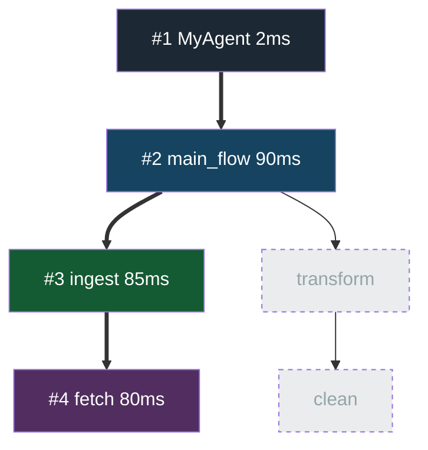

# Run Visualization

After every `engine.run()`, FlowForge records a `RunTrace` that captures which nodes executed, how long each took, and which branch was selected. You can render this as an SVG, a Mermaid diagram, or a terminal table.

---

## Quick Start

```python
import asyncio
from flowforge import FlowForge
from my_agent import MyAgent

async def main():
    engine = FlowForge.compile(MyAgent)
    result = await engine.run(my_input)

    # Terminal table
    engine.print_run_summary()

    # Mermaid diagram string
    mmd = engine.run_mermaid()
    print(mmd)

    # SVG file (requires graphviz)
    engine.visualize_run("run.svg")

asyncio.run(main())
```

---

## run_traced()

`run_traced()` returns `(result, RunTrace)` explicitly:

```python
result, trace = await engine.run_traced(my_input)

print(trace.run_id)          # short UUID (e.g. "a3f8c1d2")
print(trace.duration_ms)     # total wall-clock time in ms
print(trace.succeeded)       # True / False

# Per-node
for node in trace.nodes:
    print(
        f"[{node.execution_order}] {node.node_type:6} {node.name:30} "
        f"{node.duration_ms:.1f}ms"
        + (f"  branch={node.selected_branch}" if node.selected_branch else "")
    )
```

---

## Terminal Table — print_run_summary()

```python
engine.print_run_summary()
```

```
Run a3f8c1d2 — 12.4 ms — ✓ succeeded
┌───────┬────────┬──────────────────────┬─────────┬─────────────┬──────────┐
│ Order │ Type   │ Name                 │   ms    │ Branch      │ Status   │
├───────┼────────┼──────────────────────┼─────────┼─────────────┼──────────┤
│     1 │ flow   │ research             │   10.1  │             │ ✓        │
│     2 │ task   │ execute_search       │    8.3  │             │ ✓        │
│     3 │ step   │ optimize_query       │    1.2  │             │ ✓        │
│     4 │ branch │ source_select        │    5.8  │ web         │ ✓        │
│     5 │ step   │ deduplicate          │    0.9  │             │ ✓        │
│     6 │ task   │ analyze              │    1.4  │             │ ✓        │
│     7 │ step   │ classify_intent      │    1.3  │             │ ✓        │
└───────┴────────┴──────────────────────┴─────────┴─────────────┴──────────┘
```

---

## Mermaid Diagram — run_mermaid()

```python
mmd = engine.run_mermaid()
print(mmd)
```

Paste into [mermaid.live](https://mermaid.live) to see the annotated graph:

- **Executed nodes** — colored by type (flow/task/step/branch)
- **Error nodes** — red
- **Skipped nodes** — gray with dashed border
- **Executed edges** — bold (`==>`)
- **Skipped edges** — thin (`-->`)

```
graph TD
    classDef exec_flow   fill:#154360,color:#fff,stroke:#1a5276
    classDef exec_task   fill:#145A32,color:#fff,stroke:#1e8449
    classDef exec_step   fill:#512E5F,color:#fff,stroke:#6c3483
    classDef exec_branch fill:#641E16,color:#fff,stroke:#922b21
    classDef exec_error  fill:#C0392B,color:#fff,stroke:#e74c3c
    classDef skipped     fill:#EAECEE,color:#aaa,stroke:#bdc3c7,stroke-dasharray:4

    global["global\nagent"]:::skipped
    global.research["#1 research\n10.1ms"]:::exec_flow
    global.research.execute_search["#2 execute_search\n8.3ms"]:::exec_task
    ...
    global ==> global.research
    global.research ==> global.research.execute_search
    ...
```

---

## SVG/PNG/PDF — visualize_run()

Requires `graphviz` to be installed:

```bash
pip install graphviz
# macOS:  brew install graphviz
# Ubuntu: apt install graphviz
```

```python
# SVG (default)
engine.visualize_run("run.svg")

# PNG
engine.visualize_run("run.png", fmt="png")

# Pass an explicit trace
result, trace = await engine.run_traced(input_data)
engine.visualize_run("run.svg", trace=trace)
```

Visual encoding in the output SVG:

| Element | Meaning |
|---------|---------|
| Dark purple node | Executed `@step` |
| Dark green node | Executed `@task` |
| Dark blue node | Executed `@flow` |
| Dark red node | Executed `@branch` |
| Red node | Error node |
| Gray dashed node | Skipped node |
| Bold edge | Executed transition |
| Node label includes `#N` | Execution order |
| Node label includes `Xms` | Duration |
| Node label includes `→ branch_name` | Selected branch arm |

---

## Executed Path Report

The most useful saved Markdown artifact is usually the executed path from the
latest run. Use `compare_mermaid()` or the `--compare` flag to generate a
compact report with one Mermaid diagram. Pass `include_full_dag=True` when you
need the full compiled DAG for deeper debugging.

```python
await engine.run(my_input)

# Returns a Markdown string — executed path + legend
md = engine.compare_mermaid()

# Optional: include the full compiled DAG too
full_md = engine.compare_mermaid(include_full_dag=True)

# Save it
with open("viz.md", "w") as f:
    f.write(md)
```

The output looks like:

```
# FlowForge — Executed Path

## Run `run-a3f8c1d2`
> Status: ✓ OK · Duration: 95 ms · Executed: 4 / 6 nodes
>
> - Colored nodes ran (dark = global/flow/task/step, red = error)
> - Bold arrows (==>) are the executed edges
> - Gray dashed nodes were compiled but skipped this run


```

Open `viz.md` in **VS Code** (with the Markdown Preview), **GitHub**, or paste the Mermaid block into [mermaid.live](https://mermaid.live).

---

## CLI

```bash
# Print terminal table
flowforge run agent.py -q "input" --trace

# Print only the executed path as Mermaid
flowforge run agent.py -q "input" --viz-mermaid

# Print executed-path report
flowforge run agent.py -q "input" --compare

# Save the executed-path report to a Markdown file (recommended)
flowforge run agent.py -q "input" --compare-output viz.md

# Include the full DAG only when needed
flowforge run agent.py -q "input" --compare-output viz.md --include-full-dag

# Combine: trace table + save report
flowforge run agent.py -q "input" --trace --compare-output viz.md

# Render executed path to SVG (needs graphviz; falls back to .md)
flowforge run agent.py -q "input" --viz --viz-output run.svg

# Render PNG
flowforge run agent.py -q "input" --viz --viz-output run.png --viz-fmt png

# Save full DAG structure to Markdown
flowforge viz agent.py --save-md dag.md

# Print full DAG to stdout
flowforge viz agent.py --mermaid
```

---

## RunTrace API

```python
trace: RunTrace = engine.last_trace

# Node collections
trace.nodes                  # list[NodeTrace], in execution order
trace.executed_node_ids      # set[str] — succeeded nodes only
trace.all_visited_node_ids   # set[str] — succeeded + errored

# Run metadata
trace.run_id                 # str (UUID prefix)
trace.duration_ms            # float | None
trace.succeeded              # bool
trace.input_repr             # str (truncated repr of run input)
trace.output_repr            # str (truncated repr of run output)
trace.error                  # str | None

# Lookup
nt: NodeTrace = trace.get_node_trace("global.research.execute_search")
```

### NodeTrace fields

| Field | Type | Description |
|-------|------|-------------|
| `node_id` | `str` | DAG node ID |
| `node_type` | `str` | `"flow"` / `"task"` / `"step"` / `"branch"` |
| `name` | `str` | Short name |
| `execution_order` | `int` | 1-based counter across the whole run |
| `duration_ms` | `float \| None` | Wall-clock time in milliseconds |
| `succeeded` | `bool` | True if `finished_at` is set without error |
| `error` | `str \| None` | Error message if execution failed |
| `selected_branch` | `str \| None` | Branch key or `"__fallback__"` |
| `input_repr` | `str` | Truncated repr of node input |
| `output_repr` | `str` | Truncated repr of node output |
